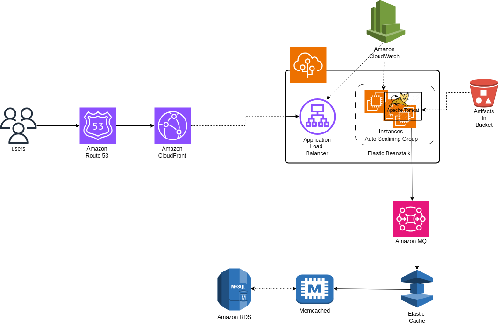

# AWS-Scalable-WebApp-Architecture

A scalable, fault-tolerant, and cloud-native web application architecture built on **AWS**, leveraging key services like **Elastic Beanstalk**, **RDS**, **CloudFront**, **ElastiCache**, **RabbitMQ**, and more.  
This project demonstrates best practices for designing and deploying highly available applications with CI/CD, observability, and automation in mind.

---

## 🚀 Architecture Overview

This architecture uses the following core AWS services:

- **Amazon Route 53** – DNS and domain routing
- **Amazon CloudFront** – Content Delivery Network (CDN)
- **Application Load Balancer (ALB)** – Scalable and secure traffic distribution
- **Elastic Beanstalk** – Application orchestration and auto-scaling
- **Amazon RDS** – Managed relational database service (e.g., MySQL, PostgreSQL)
- **Amazon ElastiCache** – In-memory caching layer (e.g., Redis or Memcached)
- **Amazon MQ (RabbitMQ)** – Messaging and queueing
- **Amazon OpenSearch** – Search and log aggregation
- **Amazon CloudWatch** – Monitoring, logging, and alerts
- **Amazon S3** – Storage for static assets and artifacts

---

## 🚀 Deployment Options

Deploy this stack on AWS using:

- **Elastic Beanstalk** – Fully managed application platform
- **Ansible** – Automated infrastructure provisioning
- **Jenkins** – Continuous Integration / Continuous Deployment (CI/CD)

---

## 🧠 Credits

Inspired by the architecture used in the [vprofile app](https://github.com/devopshydclub/vprofile-project), this project is expanded to support a broader range of frameworks and languages in a modular, scalable AWS infrastructure.

---

## 📄 License

Licensed under the [Apache License 2.0](https://www.apache.org/licenses/LICENSE-2.0).  
Feel free to use, adapt, and contribute.

---

## 🙌 Contributing

Contributions are welcome!  
If you’d like to propose changes, please open an issue or submit a pull request.

---

## 📬 Contact

Have questions, suggestions, or just want to say hi?  
Reach out via GitHub issues or email: `puspendrachawlax@gmail.com`
